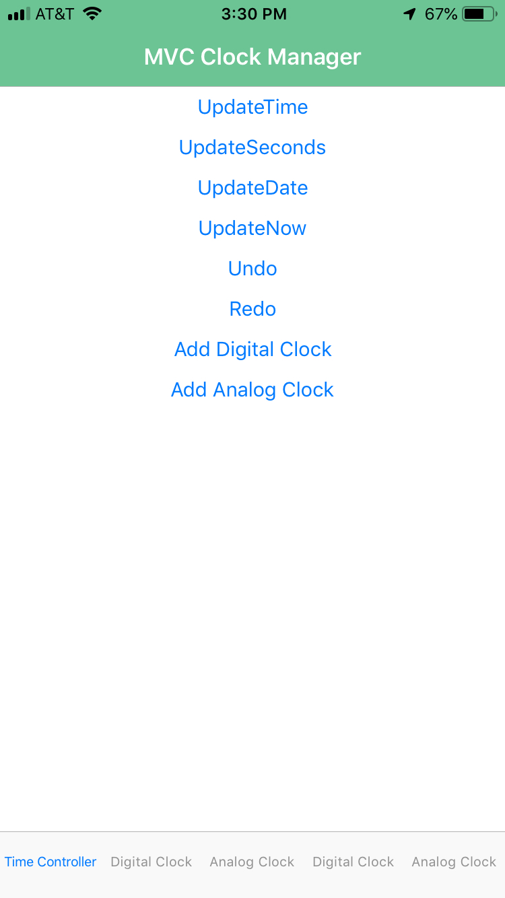
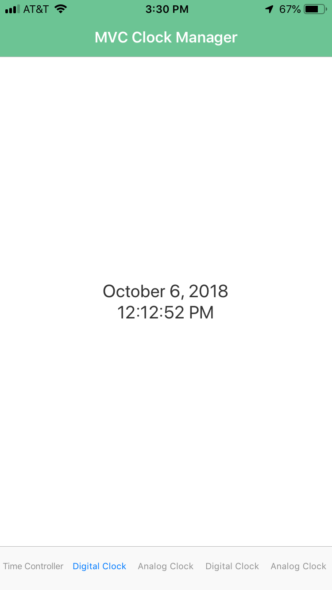
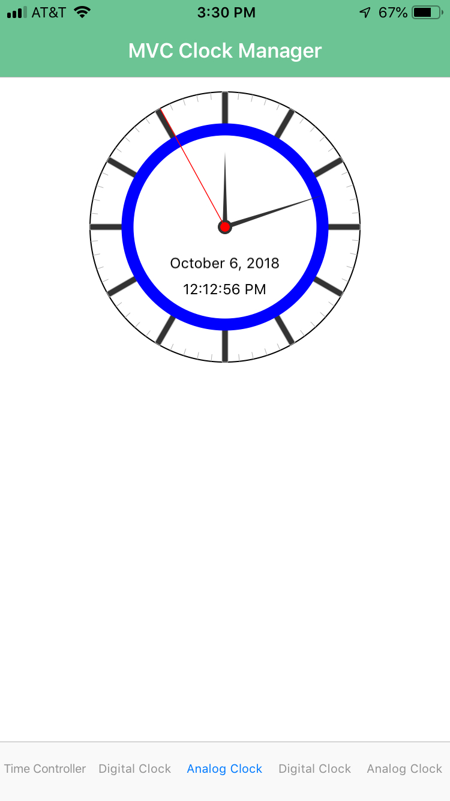
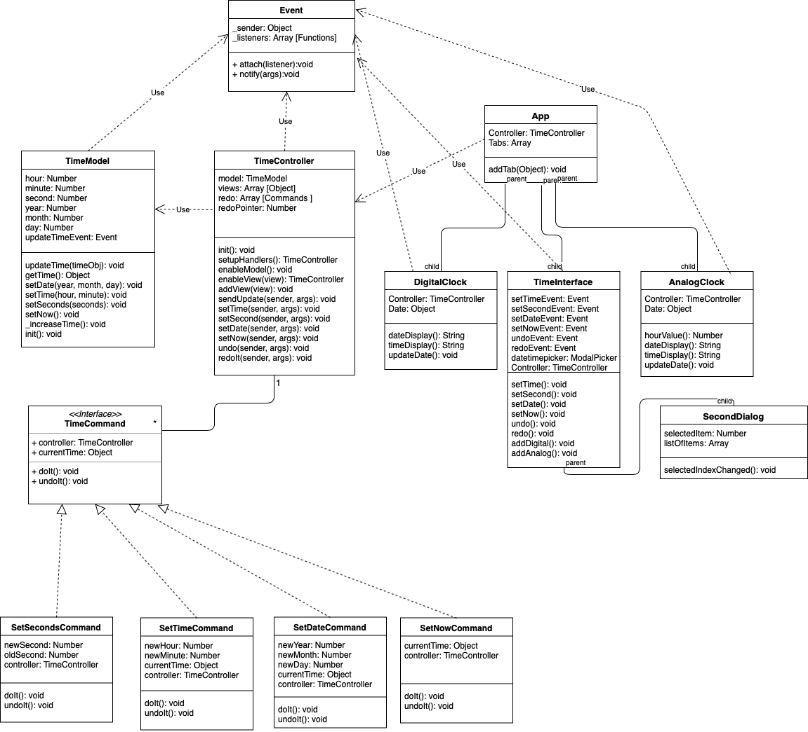

# MVC-Clock

## Features
The main features of the appication are Displaying an updating a clock interface.
The application provides three tabs when it is started for the first time, the first is called the Time Controller. 
This tab is responsible for allowing the user to update the time from the current time to any other time. 
This is handled in three parts. The first is allowing the user to update the time, when this option is selected the user is provided options for updating the hour and minute that the clock is set to. 
The second option is update the seconds, because mobile time pickers do not allow the user to update the seconds. This was done seperately and will provide the user a selection between 1 and 59 to set for the the seconds on a clock.
The third option allows the user to update the date, this is a full date picker, allowing selection of the year, month and day. 
One more option is provided to update the time, which is to set the date back to the current time and date.

This application also provides the ability to undo and redo any time changes that are made using the 'Time Controller' interface.
So those options are displayed on this screen for the user. Lastly, there are two options to add new tabs, which will correspond to clocks.
The clocks that can be added are the same as the two already open below on the application. An analog clock and a digital clock, screenshots of both can be seen below. 

The other two tabs open by default in the application display the time and are updated every second.
The two tabs display the time in digital and analog fashion respectively. As previously discussed the user can create more of these two tabs to their hearts content.

## Experience

I have often used the MVC patten in web development, however, doing this project I realized the formal design pattern and the usage in web frameworks is very different. 
I think much of this has to do with the fact that in web frameworks you are working with a stateless protocol, the result is that the controller does not need to receive updates from the model on changes, because it will not be updating the view with changes. 
I can see however, where in development in a stateful setting where the MVC pattern is very useful. 

I choose to implement my MVC also including an event class, which handles much of the inter-class communication. 
I did this to further seperate the interactions of the classes and for a cleaner design. This made updating the controller with infromation from the model much more seamless and allowed the model to not have any prior knowledge about the controller.
I personally think this is a good thing because it helped me enforce seperation between the different domains. 
The events also made communication from the views to the controller cleaner in that the view didn't have to worry about anything beyond having a function which would notify the controller.
I enjoyed implementing the MVC pattern in Javascript, which was a little bit of challenge since Javascript thinks of classes different than Java. 
But it really helped me understand more of what is happening under the hood in Javascript. 

### Screenshots







## UML Diagram 



## Testing Instructions

Testing the application can be done in two ways. 
The first method is to use an iOS simulator. 
Then using the mvcclock.app file in the bin directory drag it onto the iOS simulator and it will install the application which can be tested there.

The second method is to put the application onto a device. This is difficult because of Apple's security features.
To do that you will need familiarity with creating a signing certificate and a provisioning profile for your device, set these up in Xcode.
Then you can download this project, change the nativescript id in the package.json file to the value of your provisioning profile, and use the following commands:

```bash
# Install dependencies
npm install

# Build, watch for changes and run the application
tns run ios --bundle
```
